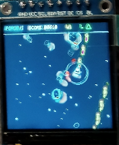

# ForgeUI MicroAsteroids — ESP32-S3 + ST7789 240×240

A physically tested joystick-controlled arcade game and graphical showcase for an ESP32-S3 DevKitC-1, a 1.54-inch ST7789 square SPI TFT at its native 240×240 resolution, and an analogue joystick. It is built on the proven ForgeUI ST7789 240×240 square-display baseline.



## PHYSICAL GAME PASS

MicroAsteroids has been physically run on the real ESP32-S3 + ST7789 240×240 hardware.

- Display initialization and full 240×240 rendering: PASS
- Joystick control, title launch, HUD, ship, asteroids, and active gameplay: PASS
- PlatformIO build and firmware flash: PASS

## Gameplay overview

Pilot the ship through successive asteroid waves. Rotate, thrust, brake, and fire with the joystick while the HUD tracks score, wave, and remaining lives. The game uses vector-style graphics, a starfield, particles, and nearby-threat indicators.

## Controls

| Joystick input | Action |
| --- | --- |
| Left / right | Rotate ship |
| Forward / up | Thrust |
| Backward / down | Brake / reverse thrust |
| Push switch | Fire |

Press the joystick switch on the title screen to launch, or after `MISSION LOST` to relaunch.

## Physical joystick mapping

| Joystick | ESP32-S3 |
| --- | --- |
| SW | GPIO4 |
| VRy | GPIO5 |
| VRx | GPIO6 |
| +5V-labelled supply | 3.3V |
| GND | GND |

GPIO7 remains spare. The firmware calibrates the joystick centre from 64 samples on startup and applies a 180-unit dead zone.

## Verified MicroAsteroids features

- ForgeUI MicroAsteroids title screen and joystick launch/relaunch
- 360-degree rotation, forward thrust, reverse/braking thrust, momentum, and speed limiting
- Screen wrapping and held-button firing with up to eight bullets
- Vector ship and vector asteroids in three sizes
- Asteroid movement, rotation, bullet collisions, splitting, and inherited fragment motion
- Particle effects and ship explosion
- Three lives, score, session high score, waves, and increasing asteroid count/speed
- Starfield, HUD, radar/threat ring, and close-threat indicators
- `SHIP LOST` and `MISSION LOST` states
- Approximately 30 FPS target loop and full-resolution `Arduino_Canvas` off-screen rendering

## Hardware

- Board: ESP32-S3 DevKitC-1
- Display: 1.54-inch square ST7789 SPI TFT
- Native resolution: 240×240
- PCB marking: `1.54TFT-SPI-ST7789 Ver:1.1`
- Input: analogue joystick with push switch

## Display wiring

| ST7789 | ESP32-S3 |
| --- | --- |
| GND | GND |
| VCC | 3.3V |
| SCL / SCLK | GPIO12 |
| SDA / MOSI | GPIO11 |
| RES / RST | GPIO10 |
| DC | GPIO9 |
| CS | GPIO8 |
| BLK | 3.3V |

MISO is unused.

For this tested 1.54-inch square module, **BLK → 3.3V is physically proven**. Do not automatically generalize this connection to other ST7789 boards.

## Proven display configuration

The firmware uses Arduino_GFX with ESP32 HSPI, CS on GPIO8, and an ST7789 configured for a 240×240 viewport. Rendering is performed through a full-resolution `Arduino_Canvas` before being flushed to the display.

## Software and build baseline

- PlatformIO
- `espressif32@6.7.0`
- `esp32-s3-devkitc-1`
- Arduino framework
- Arduino_GFX `1.3.7`

Arduino_GFX is deliberately pinned at 1.3.7 because a newer unpinned version produced an `esp32-hal-periman.h` compatibility failure in this environment. Builds can emit `SPI_MAX_PIXELS_AT_ONCE` redefinition warnings from within the pinned Arduino_GFX dependency; the physically tested build succeeds.

## Build and flash

Use PlatformIO with the pinned project configuration:

```sh
pio run
pio run --target upload
pio device monitor
```

## Physical validation record

The current photos are retained as physical evidence while improved final photos are prepared.

| Image | Evidence |
| --- | --- |
| [Splash1.png](Splash1.png) | MicroAsteroids title screen |
| [Splash2.png](Splash2.png) | Active gameplay |
| [Splash3.png](Splash3.png) | Gameplay action (current README hero) |
| [splash-st7789-240x240-square.png](splash-st7789-240x240-square.png) | Underlying display bring-up pass |

## Related square-display reference

[forgeui-hw-st7789-240x240-square](https://github.com/RTechAI/forgeui-hw-st7789-240x240-square) is the golden ForgeUI hardware reference for this physically proven square-display configuration. MicroAsteroids is an application and showcase built from that baseline.

## ForgeUI Hardware Lab

This project is part of the [ForgeUI](https://forgeui.co.nz) Hardware Lab. [ForgeUI Studio](https://studio.forgeui.co.nz) provides the broader ForgeUI interface-design context.

## External dependency and reference attribution

[Arduino_GFX](https://github.com/moononournation/Arduino_GFX) is an external dependency and retains its own copyright and license.

The independent [kursatEcinni/esp32s3-st7789-test](https://github.com/kursatEcinni/esp32s3-st7789-test) project was used as reference material during early square-display investigation. ForgeUI does not own that project; this repository does not copy its branding or LVGL demo material.

## License and repository scope

This repository documents a physically tested MicroAsteroids implementation for the stated ESP32-S3 board, display module, wiring, and joystick mapping. Validate other modules, board revisions, and wiring arrangements independently.

ForgeUI-authored content is released under the [MIT License](LICENSE). Third-party software remains subject to its respective license.
