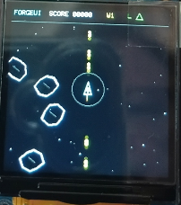

# ForgeUI MicroAsteroids — ESP32-S3 + ST7789 240×240

ForgeUI MicroAsteroids is an official ForgeUI Hardware Lab project developed by RTechAI: a physically tested joystick-controlled arcade game and graphics showcase for an ESP32-S3 DevKitC-1, a 1.54-inch ST7789 square SPI TFT at its native 240×240 resolution, and an analogue joystick.

It builds on the physically proven ForgeUI 240×240 square-display baseline and records a known-good hardware configuration alongside the application.



## PHYSICAL GAME PASS

MicroAsteroids has been physically run on the real ESP32-S3 + ST7789 240×240 hardware.

- Display initialization and full 240×240 rendering: PASS
- Joystick control, title launch, HUD, ship, asteroids, and active gameplay: PASS
- PlatformIO build and firmware flash: PASS

## Gameplay overview

Pilot the ship through successive asteroid waves. Rotate, thrust, brake, and fire with the joystick while the HUD tracks score, wave, and remaining lives. The game uses vector-style graphics, a starfield, particles, and nearby-threat indicators.

## Controls

| Joystick input | Action |
| --- | --- |
| Left / right | Rotate ship |
| Forward / up | Thrust |
| Backward / down | Brake / reverse thrust |
| Push switch | Fire |

Press the joystick switch on the title screen to launch, or after `MISSION LOST` to relaunch.

## Physical joystick mapping

| Joystick | ESP32-S3 |
| --- | --- |
| SW | GPIO4 |
| VRy | GPIO5 |
| VRx | GPIO6 |
| +5V-labelled supply | 3.3V |
| GND | GND |

GPIO7 remains spare. The firmware calibrates the joystick centre from 64 samples on startup and applies a 180-unit dead zone.

## Verified MicroAsteroids features

- ForgeUI MicroAsteroids title screen and joystick launch/relaunch
- 360-degree rotation, forward thrust, reverse/braking thrust, momentum, and speed limiting
- Screen wrapping and held-button firing with up to eight bullets
- Vector ship and vector asteroids in three sizes
- Asteroid movement, rotation, bullet collisions, splitting, and inherited fragment motion
- Particle effects and ship explosion
- Three lives, score, session high score, waves, and increasing asteroid count/speed
- Starfield, HUD, radar/threat ring, and close-threat indicators
- `SHIP LOST` and `MISSION LOST` states
- Approximately 30 FPS target loop and full-resolution `Arduino_Canvas` off-screen rendering

## Hardware

- Board: ESP32-S3 DevKitC-1
- Display: 1.54-inch square ST7789 SPI TFT
- Native resolution: 240×240
- PCB marking: `1.54TFT-SPI-ST7789 Ver:1.1`
- Input: analogue joystick with push switch

## Display wiring

| ST7789 | ESP32-S3 |
| --- | --- |
| GND | GND |
| VCC | 3.3V |
| SCL / SCLK | GPIO12 |
| SDA / MOSI | GPIO11 |
| RES / RST | GPIO10 |
| DC | GPIO9 |
| CS | GPIO8 |
| BLK | 3.3V |

MISO is unused.

For this tested 1.54-inch square module, **BLK → 3.3V is physically proven**. Do not automatically generalize this connection to other ST7789 boards.

## Proven display configuration

The firmware uses Arduino_GFX with ESP32 HSPI, CS on GPIO8, and an ST7789 configured for a 240×240 viewport. Rendering is performed through a full-resolution `Arduino_Canvas` before being flushed to the display.

## Software and build baseline

- PlatformIO
- `espressif32@6.7.0`
- `esp32-s3-devkitc-1`
- Arduino framework
- Arduino_GFX `1.3.7`

Arduino_GFX is deliberately pinned at 1.3.7 because a newer unpinned version produced an `esp32-hal-periman.h` compatibility failure in this environment. Builds can emit `SPI_MAX_PIXELS_AT_ONCE` redefinition warnings from within the pinned Arduino_GFX dependency; the physically tested build succeeds.

## Build and flash

Use PlatformIO with the pinned project configuration:

```sh
pio run
pio run --target upload
pio device monitor
```

## Physical validation record

The curated physical photos document three distinct observed states on the tested hardware.

| Image | Evidence |
| --- | --- |
| [Title / launch state](splash1-st7789-240x240.png) | Physical title screen with the launch prompt visible |
| [Active gameplay](splash3-st7789-240x240.png) | Physical gameplay screen with the ship, asteroids, HUD, and fired shots visible |
| [MISSION LOST / relaunch state](splash5-st7789-240x240.png) | Physical game-over screen with the relaunch prompt visible |

## Related ForgeUI Projects

- [Golden ST7789 240×240 Square Display](https://github.com/RTechAI/forgeui-hw-st7789-240x240-square) — the known-good ESP32-S3/ST7789 physical hardware baseline for this display family.
- [ForgeUI MicroPilot](https://github.com/RTechAI/forgeui-hw-st7789-240x240-square-micropilot) — a joystick-controlled PFD/glass-cockpit graphics showcase for the same hardware family.
- [ForgeUI MicroScope](https://github.com/RTechAI/forgeui-hw-st7789-240x240-square-microscope) — a simulated instrumentation and graphics showcase for the same hardware family.

## ForgeUI Hardware Lab

ForgeUI Hardware Lab is an RTechAI/ForgeUI collection of physically tested ESP32 boards, displays, peripherals, examples, and experimental projects. It establishes reproducible hardware baselines through hardware identification, minimal bring-up, physical proof, and preservation of known-good configurations. Demonstrations and candidate targets can then be evaluated for future ForgeUI Studio workflows.

This Hardware Lab project does not by itself indicate that this ESP32-S3/ST7789 target is currently integrated into ForgeUI Studio.

## External dependency and reference attribution

[Arduino_GFX](https://github.com/moononournation/Arduino_GFX) is an external dependency and retains its own copyright and license.

The independent [kursatEcinni/esp32s3-st7789-test](https://github.com/kursatEcinni/esp32s3-st7789-test) project was used as reference material during early square-display investigation. ForgeUI does not own that project; this repository does not copy its branding or LVGL demo material.

## License and repository scope

This repository documents a physically tested MicroAsteroids implementation for the stated ESP32-S3 board, display module, wiring, and joystick mapping. Validate other modules, board revisions, and wiring arrangements independently.

ForgeUI-authored content is released under the [MIT License](LICENSE). Third-party software remains subject to its respective license.

## About ForgeUI

ForgeUI is developed by RTechAI. [RTechAI on GitHub](https://github.com/RTechAI), [ForgeUI](https://forgeui.co.nz), and [ForgeUI Hosted Studio](https://studio.forgeui.co.nz) provide the organisation, product, and hosted development environment respectively. ForgeUI Studio is a visual embedded UI/HMI development environment for supported ESP32 hardware. ForgeUI Hardware Lab is the associated collection of physically tested hardware references, examples, and projects used to preserve reproducible physical evidence and evaluate hardware and examples for ForgeUI workflows.

ForgeUI Hosted Studio is available for public registration.
